# Shoulder To Shoulder

A web application created to combat social isolation and fight the loneliness epidemic by fostering meaningful connections.


## About The Application

In 2023, the United States Department of Health and Human Services acknowledged a profound challenge affecting millions: loneliness and social isolation have reached epidemic levels in America. This growing health concern has profound implications, as loneliness can impact mental and physical health significantly. At Shoulder to Shoulder, we are committed to addressing this silent epidemic through the power of community and connection.

Our platform is designed not just as a tool, but as a community builder that enables individuals to find and connect with like-minded people in their local area. We believe that meaningful social interactions are a key to improving personal well-being and overall community health. Shoulder to Shoulder offers a dynamic space where users can easily schedule activities and explore new places within their city, fostering real-world connections that go beyond digital interactions.

We facilitate a variety of events and activities, from hiking groups and book clubs to art classes and tech meetups. Our goal is to make it easier than ever for people to engage in shared interests and hobbies, which are crucial for building strong social ties. Whether you're new to the city, seeking to expand your social circle, or simply looking to explore new interests, Shoulder to Shoulder serves as your gateway to a more connected and fulfilling life.

Join us in combating loneliness by engaging in your community through Shoulder to Shoulder. Let's rediscover the joy of connection together, one event at a time.

## UI/UX (User) Tutorial 

Users start by signing up for an account with their name, email, phone number, and passowrd. 

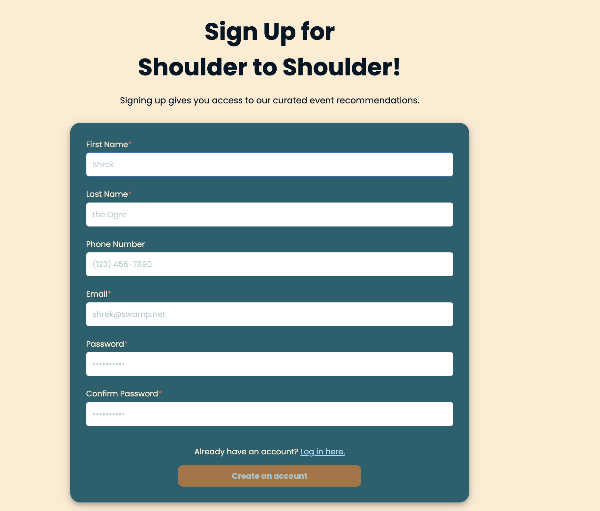

They must complete an onboarding process in order to successfully complete their account creation. Users' onboarding responses become the data that our machine learning model uses to generate personalized event recommendations for users. 

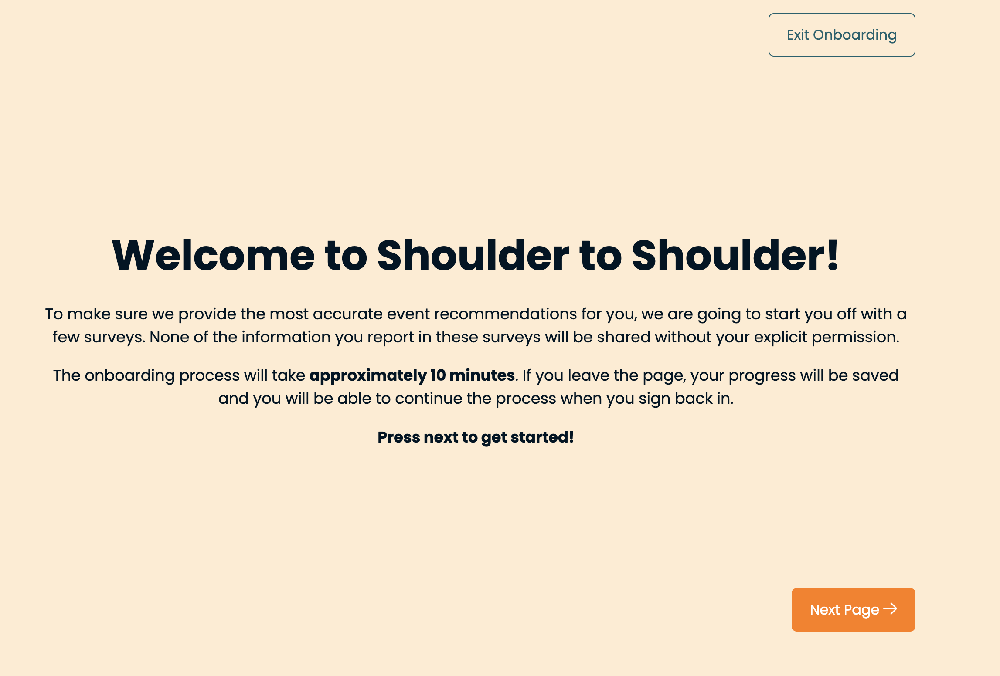

The onboarding collects three types of information: demographic information, logistics about their interests and availability, and an event preference survey. 

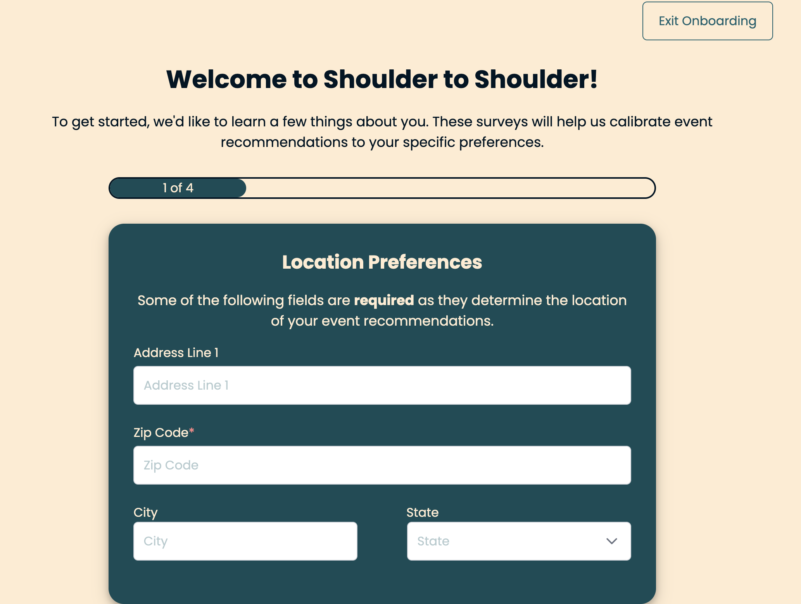  

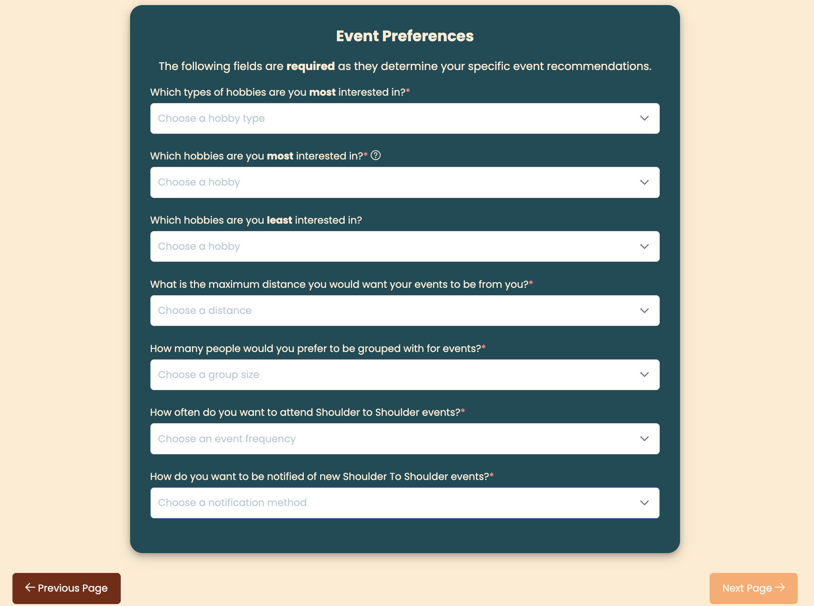  

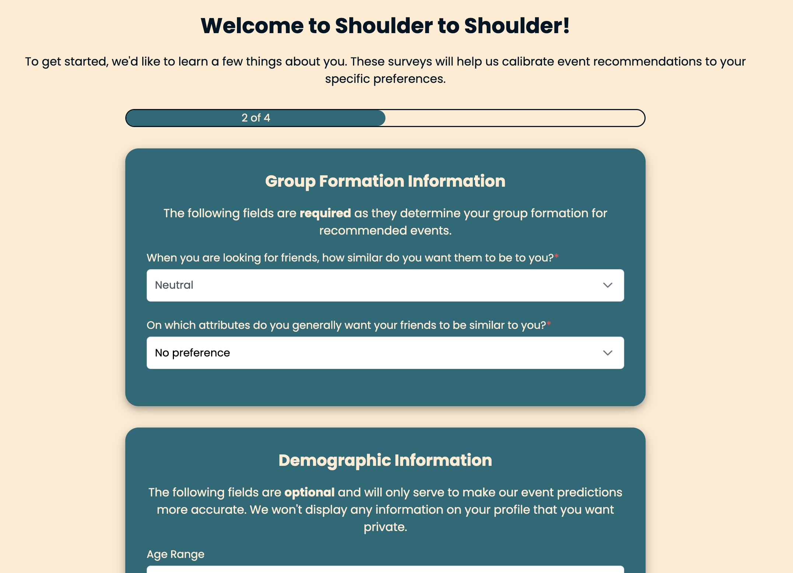  

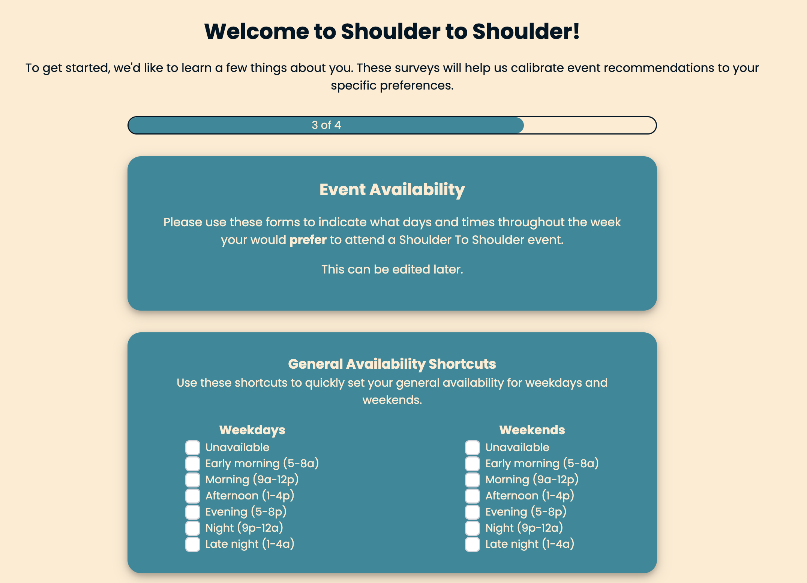  

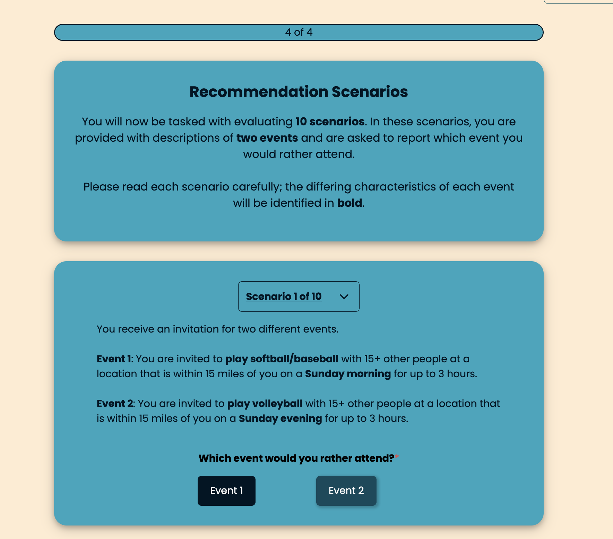  


Following the onboarding process, users are taken to their profile page. On the profile page, users can view their upcoming events and past events; rate previous events they have attended; edit their availability; edit thier personal information and password; edit their onboarding responses; and upload a profile photo. 


Events get added to the database by users themselves. Our application has a submission form for Event Creation where users can post an event they know about or plan on attending by entering it's information. The created event is saved to the database and will be recommended to matched users until it reaches capacity.

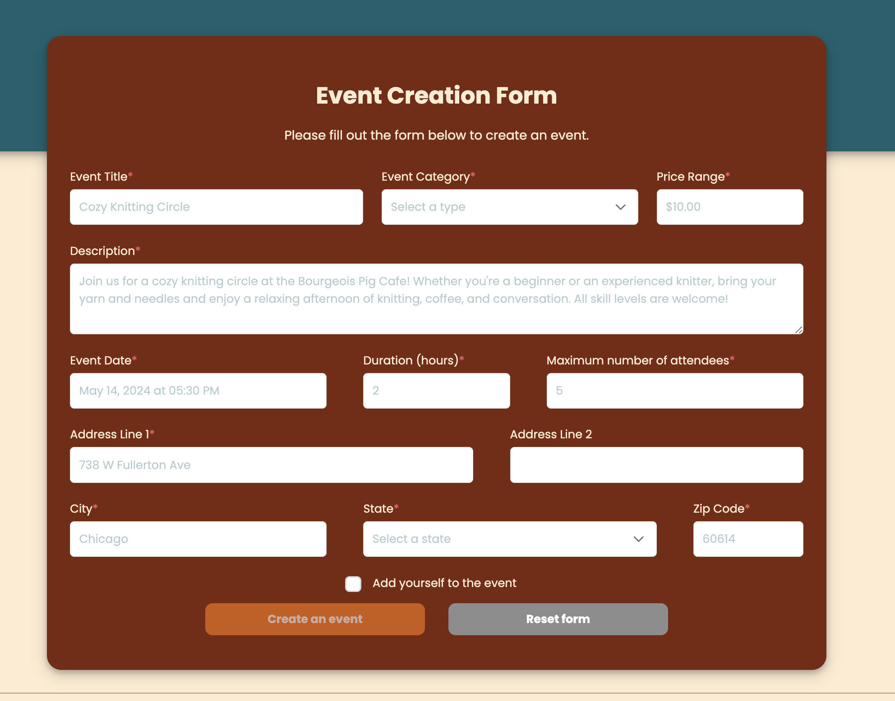

Periodically, users will receive event recommendations through notifications on their profile, and they can accept or reject the event invitation. 

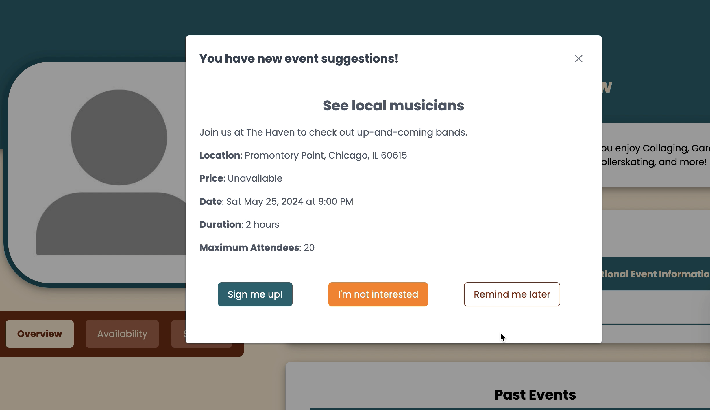

And finally, users can contact the development team at any point with questions and concerns they may have!

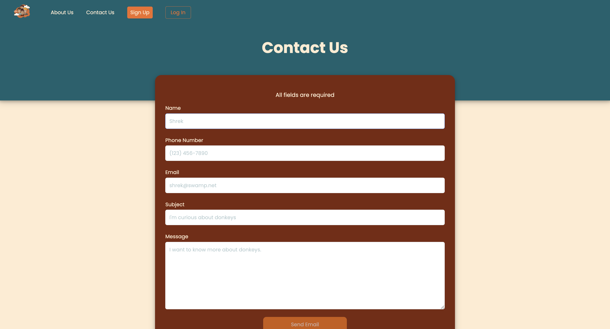


## Application Features
The frontend, user facing component employs Angular with Nodejs dependencies. The backend connection employs Django with an AWS Postgre(SQL) database. All of our application's data is generated through user inputs.

Special features of our application include:
- A machine learning module, which trains user preferences and feedback to create personalized event recommendations for each user. To generate user recommendations, our machine learning algorithm employs a deep factorization machine (DeepFM). 
- A GIS module, which is used to locate events happening within a specified distance of a user's resident location; verify that inputted addresses exist; and locate places based on a given zipcode. 
- Deployment on AWS, which sets up our app on a server.
- The AWS deployment also establishes a CronJob which is used to schedule weekly email notifications sent from the app to users (every Sunday at 8am CT). Additionally, when users sign up for an event, the event confirmation and information gets sent in an email to the user.
- Secure information handling is established in multiple ways: 1. users must sign-up and log-in with their email and password (which must, at a minimum, have 8 characters, one lower case letter, one upper case letter, one number, and one special charcter); 2. JSON web tokens are used to authorize interaction with our API, including JWT access tokens for each user and also a single, application wide JWT token (each endpoint in the backend has different permissions and can only be accessed if the users / super users possess the required tokens); 3. integrated Zipcode and GIS APIs are used to verify if inputted locations exist, in order to prevent fake locations from being saved to events. 

## How To Run The App

To open and use the application, first clone the repository to your local machine, and navigate to the `ShoulderToShoulder` directory in your terminal. 

Next, you will need to set up and launch both the frontend module and the backend module at the same time in order to get the frontend and backend working in tandem. Follow these steps in your terminal:

<pre>
```
brew install nodejs
cd frontend
npm install -g @angular/cli
npm install
cd s2s
ng serve
```
</pre>

Navigate to `localhost:4200/` in your web browser. 

Now, open a new terminal and run:

<pre>
```
cd backend
poetry env use 3.12
poetry shell
poetry install
python shoulder/manage.py runserver
```
</pre>

Navigate to `localhost:8000/data` in a new tab in your web browser and enter the superuser log-in credentials.

Now, you can interact with the app through the frontend `localhost:4200/` browser, and your responses and data will be saved in real time to the `localhost:8000/data` backend browser. 

To exit the application, run ctrl+C (i.e. ^C) in both terminals to shut down the local hosts.

## Meet the Team

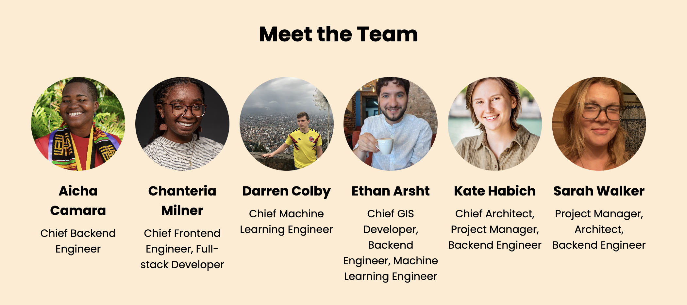

- Aïcha Camara
    - Aïcha is a second year Master's student at the University of Chicago. They are passionate about exploring Chicago and interested in finding new places to hike or eat tasty food around the city.
- Chanteria Milner
    - Chanteria is a second year Master's student studying computational analysis and public policy. When she is not coding for the U.S. Census Bureau, Chanteria enjoys finding new knitting patterns, buying too many books, and petting her cat, Clover.
- Darren Colby
    - Darren is a second year Master's student at the University of Chicago. He is excited to apply his data science skills to difficult public policy challenges and spends his free time swimming and excercising.
- Ethan Arsht
    - Ethan is a second year graduate student at the University of Chicago. He likes biking, baking, board games, building things, and alliteration.
- Kate Habich
    - Kate is a second year Master's student at the University of Chicago studying comutational analysis and public policy with a focus on environmental issues. They enjoy picking up new hobbies and skills including crochetting, writing, and spending time outdoors.
- Sarah Walker
    - Sarah is a second year Master's student at the University of Chicago. As a student it can be difficult for her to find time to invest in her social life; she also finds it difficult to meet new people and try new things on such a tight schedule. She is glad to be working on a project aimed at connecting others who may feel lonely or stuck in their daily routines.


