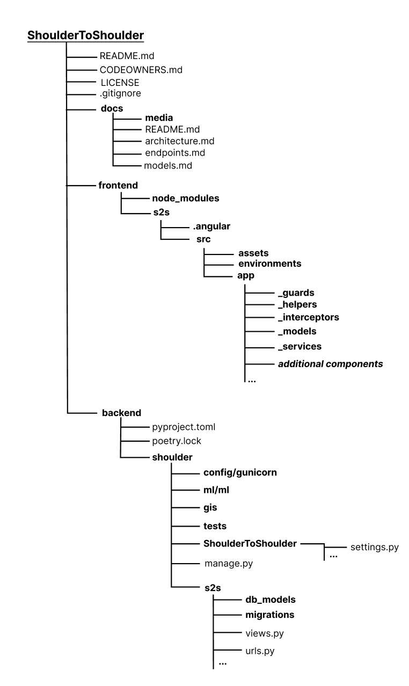
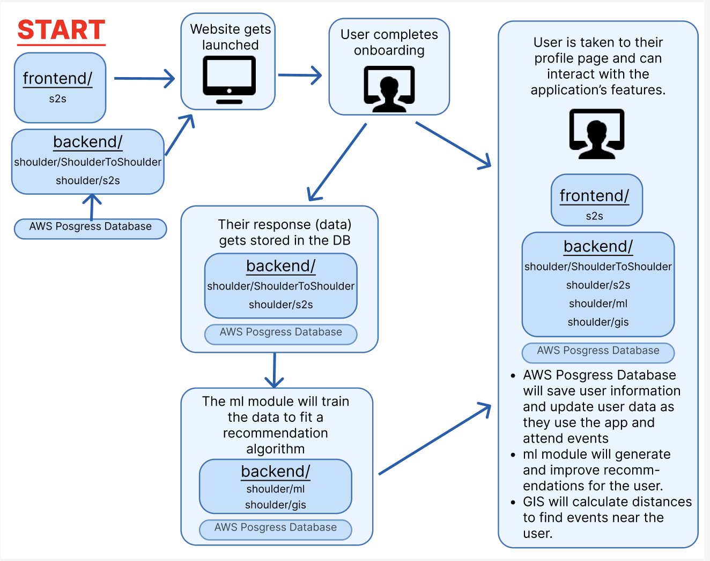

# ShoulderToShoulder Architecture Documentation

## Architecture Diagram

A high level overview of our repository structure:

## Repository Contents

#### `frontend`
Directory with our web application's frontend development, which serves our UI/UX and user interaction. Our frontend employs Angular.

#### `backend/shoulder` 
Directory with our web application's backend development. Our backend employs Django with an AWS Posgres(QL) database. The backend development also involves a machine learning component, a GIS component, and a directory containing unit testing. 

#### `backend/shoulder/s2s` and `backend/shoulder/ShoulderToShoulder` 
The two directories which house our Django development. This is where the backend team manages the database, the models, the API endpoints (viewpsets), and the overall backend connection to the web application.  

#### `backend/shoulder/config/gunicorn`
The directory which establishes our application's AWS deployment; this sets up our app on a server and also schedules the cron job to send users weekly email notifications. 

#### `backend/shoulder/ml/ml`
Directory which contains our web application's machine learning development. Machine learning is used by our application to provide users with recommendations for events to attend.

To generate user recommendations, we employ a deep factorization machine (DeepFM). A DeepFM
consists of three main components, as shown in the picture below.

The embedding layer takes in vectors of user by event information and encodes it into a higher
dimensional space. Each unique feature value is represented by a unique integer which corresponds
to an index into an embedding matrix. For example, if each user by item data point contains
five features and we want to represent features by ten dimensional embeddings, then each of
the five features would have a 1 x 10 embedding vector and the user would have a 5x10 embedding,
which is updated during training. This is equivalent to learning a linear layer but it saves
computation by not having to execute expensive matrix multiplications. The outputs of the
factorizaion machine are raw scores for each user.

The user-event embeddings are then passed into a facorization machine and an MLP. A factorization
machine is like a linear regression that accounts for every second order user-event x user-event
interaction but instead of naively conducting such a regression, the factorization computes
an equivalents but more computationally efficient model.

The user-event embeddings are also passed to an MLP, which utilizes dense layers with relu and
a tunable dropout parameter for regularization. The final output of the MLP are also raw scores
for each user.

Finally, the raw outputs from the factorization machine and the MLP are summed and passed
through a sigmoid function to calculate probabilities of a user attending an event.

Our overall training strategy is to pretrain our DeepFM once we have a sufficient amount of
information and then periodically fine tune it by executing a small number of training epochs
on new data.

For more information on factorization machines and DeepFMs, see:

- Rendle, Steffen. "Factorization machines." In 2010 IEEE International conference on data mining, pp. 995-1000. IEEE, 2010.

- Guo, Huifeng, Ruiming Tang, Yunming Ye, Zhenguo Li, and Xiuqiang He. "DeepFM: a factorization-machine based neural network for CTR prediction." arXiv preprint arXiv:1703.04247 (2017). 

#### `backend/shoulder/gis`
Directory which contains our web application's GIS module. We use spatial analysis to: locate events happening within a specified distance of a user's resident location; verify that inputted addresses exist; and locate places based on a given zipcode. 

#### `backend/shoulder/tests`
The directory which contains all of the unit testing for the backend module. We use pytest to test the information being passed to and from the ml and gis modules, and pytest-django to test the Django backend viewpoints. 

## About Our Data

Our data is sourced from user inputs. When users sign up for an account our application (frontend url: http://localhost:4200/#/sign-up), they go through an onboarding process before completing their account creation (frontend url: http://localhost:4200/#/onboarding). The onboarding collects three types of information: demographic information, logistics about their interests and availability, and an event preference survey. User responses get saved as data into our database. This is the data that our machine learning model uses to generate personalized event recommendations for users. 

Event data gets added to the database by users themselves. Our web application has a submission form (frontend url: http://localhost:4200/#/event-creation) where users can upload an event they know about or plan on attending by entering it's information; the created event is posted to the database and will be recommended to matched users until it reaches capacity.

Finally, a display of user's upcoming and past events, event recommendations, user rsvp status to events, and any feedback that user's provide about the events they attend (for ex., their rating of the event) get tracked on their profile. This information becomes additional data that will get saved in our database and used by our model to improve future recommendations. 

Note: A Groups feature is not currently implemented in version 1 of Shoulder To Shoulder, however this is an additional element which can be added in version 2. 

